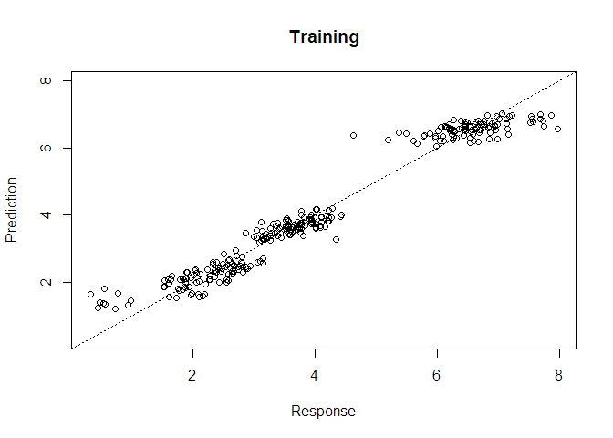
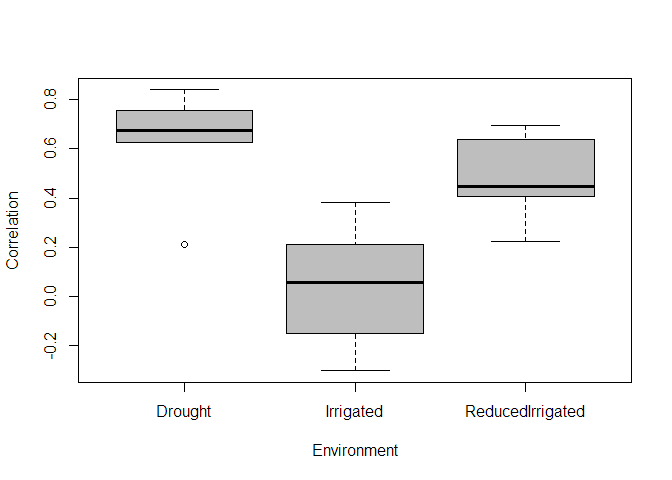

BGFRA
================
Francisco Javier Luna-Vázquez
2018-02-05

Bayesian Genomic Functional Regression Analysis in R

Instructions for proper implementation
--------------------------------------

### Installation

To complete installation of dev version of BGFRA from GitHub, you have to install a few packages first.

``` r
install.packages('devtools')
devtools::install_github('frahik/BGFRA')
```

### Quick use

#### Load data

``` r
rm(list = ls())
library(BGFRA)
data("wheat_BGFRA")

data <- Wheat # Load from data wheat_BGFRA
Bands <- Bands # Load from data wheat_BGFRA
Wavelengths <- Wavelengths # Load from data wheat_BGFRA

## Linear predictor
ETA2 <- list(Env = list(X = model.matrix(~0+as.factor(data$Env)), model = "FIXED"),
             Line = list(X = model.matrix(~0+as.factor(data$Line)), model = "BRR"),
             Bands = list(X = Fourier.Basis(Bands, Wavelengths, n.basis = 21, interaction = NULL), model = "BRR")
)
```

#### Fit model

``` r
fm2 <- BGFRA(data, ETA = ETA2, nIter = 1000, burnIn = 300)
```

    ##  Degree of freedom of LP 2  set to default value (5).
    ##  Scale parameter of LP 2  set to default value (4.36140493944161) .
    ##  Degree of freedom of LP 3  set to default value (5).
    ##  Scale parameter of LP 3  set to default value (0.0143843271440224) .

``` r
summary(fm2)
```

    ## --------------------> Summary of data & model <-------------------- 
    ## 
    ##  Number of phenotypes= 300 
    ##  Min (TRN)=  0.3184033 
    ##  Max (TRN)=  7.971726 
    ##  Variance of phenotypes (TRN)= 3.701 
    ##  Residual variance= 0.2514 
    ##  N-TRN= 300   N-TST=0 
    ## 
    ## 
    ##  -- Linear Predictor -- 
    ## 
    ##  Intercept included by default
    ##  Coefficientes in ETA[ 1 ] ( Env ) were asigned a flat prior
    ##  Coefficientes in ETA[ 2 ] ( Line ) modeled as in  BRR 
    ##  Coefficientes in ETA[ 3 ] ( Bands ) modeled as in  BRR 
    ## 
    ## ------------------------------------------------------------------

``` r
plot(fm2)
```



### Cross-validation model

``` r
pm2 <- BGFRA(data, ETA = ETA2, nIter = 1000, burnIn = 300, folds = 5, set_seed =10)
```

    ## This might be time demanding, let's take sit and a cup of coffe
    ## 
    ## Done.

``` r
pm2$results
```

    ##           Fold              Env         Cor       MSEP
    ## 1            1        Irrigated  0.21192022 0.13730302
    ## 2            1          Drought  0.21282402 0.46105609
    ## 3            1 ReducedIrrigated  0.63841829 0.06404149
    ## 4            2 ReducedIrrigated  0.40629549 0.18485351
    ## 5            2          Drought  0.62740928 0.14495250
    ## 6            2        Irrigated  0.07102850 0.45498638
    ## 7            3 ReducedIrrigated  0.22143619 0.21653148
    ## 8            3          Drought  0.71513720 0.30818454
    ## 9            3        Irrigated  0.38237363 0.21510980
    ## 10           4 ReducedIrrigated  0.69529837 0.08445748
    ## 11           4        Irrigated -0.30202594 0.47252300
    ## 12           4          Drought  0.83894772 0.17124229
    ## 13           5        Irrigated -0.15164323 0.57306379
    ## 14           5 ReducedIrrigated  0.41910797 0.11134734
    ## 15           5          Drought  0.75624440 0.24737482
    ## 16 Average_all        Irrigated  0.04233063 0.37059720
    ## 17 Average_all          Drought  0.63011253 0.26656205
    ## 18 Average_all ReducedIrrigated  0.47611126 0.13224626

``` r
boxplot(pm2)
```



### Params

In progress

Advanced demos
--------------

Citation
--------

How to cite the package...

Authors
-------

Francisco Javier Luna-Vázquez (Author, Maintainer)

Osval Antonio Montesinos-López (Author)
