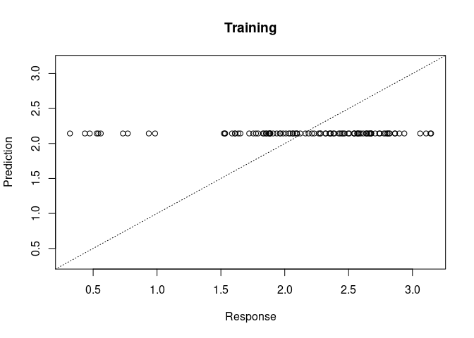
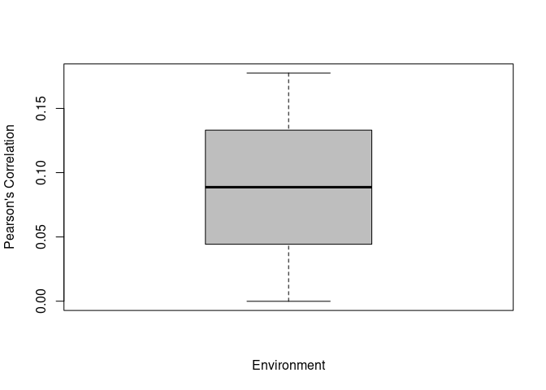
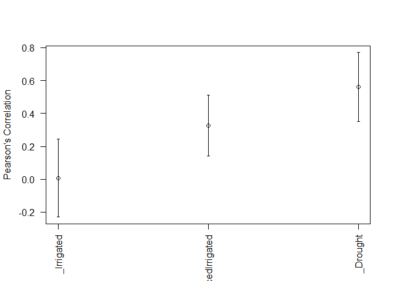
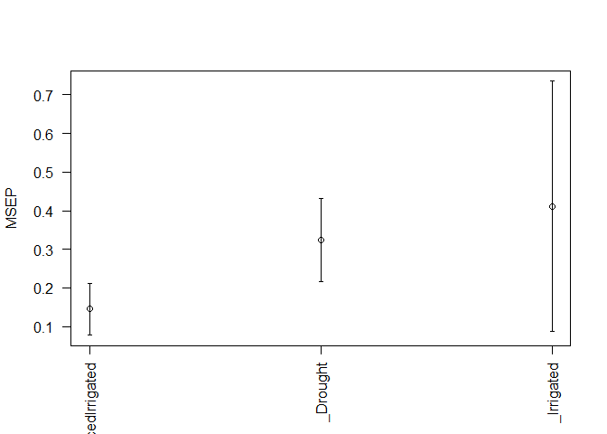
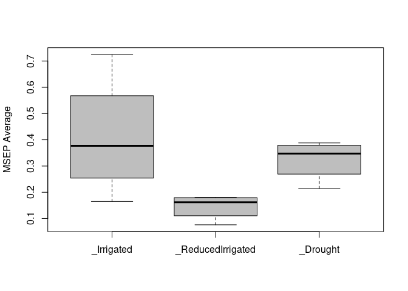

<p align="center">
<a href="https://github.com/frahik/GFR">  </a>
<h3 align="center">
    Genomic Functional Regression analysis in R | Development version 0.9 - rev 10

</h4>
<p align="center">
<a href="https://www.gnu.org/licenses/lgpl-3.0">  </a> <a href="http://www.repostatus.org/#wip">  </a> <a href="">  </a> <a href="https://cran.r-project.org/package=GFR">  </a>
</p>
<h4 align="center">
    [Last README update: 2018-03-22]

</h4>
</p>

------------------------------------------------------------------------

Table of contents
=================

-   [NEWS](#news)
-   [Instructions](#instructions)
    -   [Installation](#install)
    -   [Demostration examples](#demo)
    -   [Web version](#shinyapp)
    -   [Available data](#data)
    -   [Fitting a model](#fit-model)
    -   [Predictive model](#predictive-model)
    -   [Example \#1 of how generate automatically a linear predictor](#auto-ETA)
    -   [Example \#2 of how generate automatically a linear predictor](#auto-ETA2)
    -   [Example of how generate manually a linear predictor](#HM-ETA)
-   [How to cite this package](#cite)
-   [Contributions](#contributions)
-   [Authors](#authors)

<h2 id="news">
News of this version (0.9)
</h2>
Revision 10

-   The package now inclues a shiny app.

Past revisions

-   Rename from BGFRA -&gt; BFR -&gt; GFR
-   Initial development is in progress, but there has not yet been a stable, usable release suitable for the public; this is a pre-release, be careful.

<h2 id="instructions">
Instructions for proper implementation
</h2>
<h3 id="install">
Installation
</h3>
To complete installation of dev version of GFR from GitHub, you have to install a few packages first.

``` r
install.packages('devtools')
devtools::install_github('frahik/GFR')
```

<h3 id="demo">
Demostration examples
</h3>
<h4 id="shinyapp">
Package Web version
</h4>
The package includes a shiny app to very easy use of the package, includes the most essencial parts, to use this,

``` r
library(GFR)
runInterface()
```

<h4 id="data">
Availabe data
</h4>
Three data sets are available inside the package, to use it use `data()` function,

``` r
rm(list = ls())
library(GFR)
data("Wheat_GFR")
head(Wheat_GFR) # Load from data Wheat_GFR
```

    ##   Response    Line     Env
    ## 1 1.587324 3827768 Drought
    ## 2 3.140629 6176013 Drought
    ## 3 3.145934 4905617 Drought
    ## 4 0.984776 6931494 Drought
    ## 5 2.936291 6932344 Drought
    ## 6 1.882823 6935856 Drought

``` r
paste0('Dimension of the Bands matrix: ', dim(Wheat_Bands)) # Load from data Wheat_GFR
```

    ## [1] "Dimension of the Bands matrix: 300"
    ## [2] "Dimension of the Bands matrix: 250"

``` r
paste0('Number of wavelenths:', length(Wheat_Wavelengths)) # Load from data Wheat_GFR
```

    ## [1] "Number of wavelenths:250"

``` r
data("WheatI_GFR")
head(WheatI_GFR) # Load from data WheatI_GFR
```

    ##   Line Response       Env
    ## 1    1 6.862352 Irrigated
    ## 2    2 6.844494 Irrigated
    ## 3    3 6.290179 Irrigated
    ## 4    4 7.026786 Irrigated
    ## 5    5 6.013394 Irrigated
    ## 6    6 6.639137 Irrigated

``` r
paste0('Dimension of the Bands matrix: ',dim(WheatI_Bands)) # Load from data WheatI_GFR
```

    ## [1] "Dimension of the Bands matrix: 976"
    ## [2] "Dimension of the Bands matrix: 250"

``` r
paste0('Number of wavelenths:',length(WheatI_Wavelengths)) # Load from data WheatI_GFR
```

    ## [1] "Number of wavelenths:250"

``` r
data("Maize_GFR")
head(Maize_GFR) # Load from data Maize_GFR
```

    ##        Line Env Trait Response
    ## 1 CKDHL0002 EBU Yield     6.65
    ## 2 CKDHL0003 EBU Yield     6.10
    ## 3 CKDHL0004 EBU Yield     5.07
    ## 4 CKDHL0005 EBU Yield     6.55
    ## 5 CKDHL0007 EBU Yield     6.82
    ## 6 CKDHL0008 EBU Yield     6.88

``` r
paste0('Dimension of the Bands matrix: ',dim(Maize_Bands)) # Load from data Maize_GFR
```

    ## [1] "Dimension of the Bands matrix: 2781"
    ## [2] "Dimension of the Bands matrix: 48"

``` r
paste0('Number of wavelenths:',length( Maize_Wavelengths)) # Load from data Maize_GFR
```

    ## [1] "Number of wavelenths:48"

<h4 id="fit-model">
Fitting a model
</h4>
To more simple way to fit a model is with one environment and one trait data,

``` r
data("Wheat_GFR")
data <- Wheat_GFR[which(Wheat_GFR$Env == 'Drought'), ]

fm <- BFR(data, nIter = 1000, burnIn = 300, verbose = F)

plot(fm)
```



<h4 id="predictive-model">
Predictive model with a K-Folds Cross-validation
</h4>
To do a predictive model with a cross-validation, only we need to provide a list object with the type and the number of crossvalidation to do, in the package is available two cross-validatin types, in the following code, we see the CV K-Folds,

``` r
data("Wheat_GFR")
data <- Wheat_GFR[which(Wheat_GFR$Env == 'Drought'), ]
Crossvalidation_list <- list(Type = 'KFold', nFolds = 3)

pm <- BFR(data, nIter = 1000, burnIn = 300, set_seed = 10, CrossValidation = Crossvalidation_list, verbose = F)
```

    ## Warning in cor(Tab_i$y_p, Tab_i$y_o, use = "pairwise.complete.obs"): the
    ## standard deviation is zero

``` r
summary(pm)
```

    ##          Fold     Env Trait Pearson SE_Pearson   MSEP SE_MSEP   Time
    ## 1           1 Drought        0.1775         NA 0.2653      NA 1.3880
    ## 2           2 Drought            NA         NA 0.6432      NA 0.1060
    ## 3           3 Drought       -0.0001         NA 0.4550      NA 0.0650
    ## 4 Average_all Drought        0.0887     0.0725 0.4545  0.1091 0.5197

``` r
boxplot(pm)
```



<h4 id="auto-ETA">
Generate automatically a linear predictor (Only Multi-Environment example)
</h4>
For more advanced predictions, we also provide a eta generator, for the estimations, this function automatically prepare the data and do a lot of validations, this is the recomended way to do a proper analysis,

``` r
library(GFR)
data("Wheat_GFR")
CrossV <- list(Type = 'KFold', nFolds = 3)
ETA2 <- ETAGenerate(Wheat_GFR, datasetID = 'Line', priorType = 'BayesB', Bands = Wheat_Bands,
                    Wavelengths = Wheat_Wavelengths, method = 'Alternative2', basisType = 'Bspline.Basis', nBasis = 21)


pm2 <- BFR(ETA = ETA2, data, nIter = 1000, burnIn = 300, set_seed = 10, CrossValidation = CrossV, verbose = F)
summary(pm2)
```

    ##           Fold              Env Trait Pearson SE_Pearson   MSEP SE_MSEP
    ## 1            1        Irrigated        0.2519         NA 0.1672      NA
    ## 2            1          Drought        0.3727         NA 0.3692      NA
    ## 3            1 ReducedIrrigated        0.0914         NA 0.1330      NA
    ## 4            2 ReducedIrrigated        0.3414         NA 0.1868      NA
    ## 5            2          Drought        0.6947         NA 0.2161      NA
    ## 6            2        Irrigated        0.1901         NA 0.3198      NA
    ## 7            3          Drought        0.5841         NA 0.3702      NA
    ## 8            3 ReducedIrrigated        0.1342         NA 0.1391      NA
    ## 9            3        Irrigated       -0.3217         NA 0.5997      NA
    ## 10 Average_all        Irrigated        0.0401     0.1818 0.3622  0.1266
    ## 11 Average_all          Drought        0.5505     0.0945 0.3185  0.0512
    ## 12 Average_all ReducedIrrigated        0.1890     0.0772 0.1529  0.0170
    ##      Time
    ## 1  1.2160
    ## 2      NA
    ## 3      NA
    ## 4  1.1540
    ## 5      NA
    ## 6      NA
    ## 7  1.0790
    ## 8      NA
    ## 9      NA
    ## 10 1.1497
    ## 11     NA
    ## 12     NA

``` r
plot(pm2)
```



<h4 id="auto-ETA2">
Generate automatically a linear predictor (Multi-Trait & Multi-Environment example)
</h4>
Also, you can add some special terms, but be carefull,

``` r
data("Maize_GFR")
CrossV <- list(Type = 'RandomPartition', NPartitions = 3, PTesting = .25)
ETA3 <- ETAGenerate(Maize_GFR, basisType = 'Bspline.Basis', Bands = Maize_Bands, Wavelengths = Maize_Wavelengths, priorType = 'BRR', method = 'Simple', nBasis = 21)
ETA3$Design
```

    ## [1] "Bayes-MultiBands"

``` r
ETA3$Basis
```

    ## [1] "Bspline.Basis"

``` r
ETA3$Prior
```

    ## [1] "BRR"

``` r
ETA3$Method
```

    ## [1] "Simple"

``` r
pm3 <- BFR(ETA = ETA3, data, nIter = 1000, burnIn = 300, set_seed = 10, CrossValidation = CrossV, verbose = F)
summary(pm3)
```

    ##           Fold Env Trait Pearson SE_Pearson     MSEP  SE_MSEP   Time
    ## 1            1 EBU   ASI  0.1668         NA   4.2592       NA 34.388
    ## 2            1 KAK   ASI -0.1026         NA   5.7702       NA     NA
    ## 3            1 KTI   ASI  0.0722         NA   5.1299       NA     NA
    ## 4            1 EBU    PH  0.0043         NA 120.0482       NA     NA
    ## 5            1 KAK    PH  0.4246         NA 167.1178       NA     NA
    ## 6            1 KTI    PH -0.0221         NA 336.7745       NA     NA
    ## 7            1 EBU Yield  0.1243         NA   4.3735       NA     NA
    ## 8            1 KAK Yield  0.0511         NA   5.7813       NA     NA
    ## 9            1 KTI Yield -0.1640         NA   6.7589       NA     NA
    ## 10           2 EBU   ASI  0.2678         NA   3.5201       NA 35.222
    ## 11           2 KAK   ASI  0.2889         NA   3.4843       NA     NA
    ## 12           2 KTI   ASI -0.0751         NA   5.1514       NA     NA
    ## 13           2 EBU    PH -0.0604         NA 112.8466       NA     NA
    ## 14           2 KAK    PH  0.3229         NA 127.8429       NA     NA
    ## 15           2 KTI    PH  0.5081         NA 209.1478       NA     NA
    ## 16           2 EBU Yield  0.1364         NA   3.5517       NA     NA
    ## 17           2 KAK Yield  0.1087         NA   3.6162       NA     NA
    ## 18           2 KTI Yield  0.1264         NA   5.3792       NA     NA
    ## 19           3 EBU   ASI  0.0354         NA   4.4649       NA 35.315
    ## 20           3 KAK   ASI -0.0533         NA   6.7697       NA     NA
    ## 21           3 KTI   ASI  0.0124         NA   4.1109       NA     NA
    ## 22           3 EBU    PH  0.0076         NA 462.8990       NA     NA
    ## 23           3 KAK    PH  0.4136         NA 113.8976       NA     NA
    ## 24           3 KTI    PH  0.2040         NA 307.4324       NA     NA
    ## 25           3 EBU Yield -0.0118         NA   5.4778       NA     NA
    ## 26           3 KAK Yield  0.0097         NA   5.4797       NA     NA
    ## 27           3 KTI Yield  0.1427         NA   4.3796       NA     NA
    ## 28 Average_all EBU   ASI  0.1567     0.0673   4.0814   0.2869 34.975
    ## 29 Average_all KAK   ASI  0.0443     0.1231   5.3414   0.9723     NA
    ## 30 Average_all KTI   ASI  0.0032     0.0428   4.7974   0.3433     NA
    ## 31 Average_all EBU    PH -0.0162     0.0221 231.9313 115.5026     NA
    ## 32 Average_all KAK    PH  0.3871     0.0322 136.2861  15.9328     NA
    ## 33 Average_all KTI    PH  0.2300     0.1536 284.4516  38.5929     NA
    ## 34 Average_all EBU Yield  0.0830     0.0475   4.4677   0.5580     NA
    ## 35 Average_all KAK Yield  0.0565     0.0287   4.9590   0.6771     NA
    ## 36 Average_all KTI Yield  0.0350     0.0996   5.5059   0.6898     NA

<h4 id="HM-ETA">
Handmade linear predictor
</h4>
If you are a expert and know what are you doing, you can generate the ETA manually,

``` r
CrossV <- list(Type = 'KFold', nFolds = 3)
ETA4 <- list(Env = list(X = model.matrix(~0+as.factor(Wheat_GFR$Env)), model = 'FIXED'),
             Line = list(X = model.matrix(~0+as.factor(Wheat_GFR$Line)), model = 'BRR'),
             Bands = list(X = Bspline.Basis(Wheat_Bands, Wheat_Wavelengths, nBasis = 23), model = 'BayesA'))
pm4 <- BFR(data = Wheat_GFR, ETA = ETA4, nIter = 1000, burnIn = 300, CrossValidation = CrossV, set_seed = 10, verbose = F)
summary(pm4)
```

    ##           Fold              Env Trait Pearson SE_Pearson   MSEP SE_MSEP
    ## 1            1        Irrigated        0.0829         NA 0.1649      NA
    ## 2            1          Drought        0.2781         NA 0.3881      NA
    ## 3            1 ReducedIrrigated        0.5140         NA 0.0760      NA
    ## 4            2 ReducedIrrigated        0.3857         NA 0.1803      NA
    ## 5            2          Drought        0.7182         NA 0.2142      NA
    ## 6            2        Irrigated        0.1544         NA 0.3431      NA
    ## 7            3          Drought        0.5427         NA 0.3707      NA
    ## 8            3 ReducedIrrigated        0.2257         NA 0.1787      NA
    ## 9            3        Irrigated       -0.4164         NA 0.7249      NA
    ## 10 Average_all        Irrigated       -0.0597     0.1795 0.4110  0.1652
    ## 11 Average_all          Drought        0.5130     0.1279 0.3243  0.0553
    ## 12 Average_all ReducedIrrigated        0.3751     0.0834 0.1450  0.0345
    ##      Time
    ## 1  2.1230
    ## 2      NA
    ## 3      NA
    ## 4  0.7560
    ## 5      NA
    ## 6      NA
    ## 7  0.5780
    ## 8      NA
    ## 9      NA
    ## 10 1.1523
    ## 11     NA
    ## 12     NA

``` r
plot(pm4, select = 'MSEP')
```



``` r
boxplot(pm4, select = 'MSEP')
```



<h4 id="autoclean">
Clean the working directory
</h4>
If you don't need anymore the files that the `BFR()` function creates, you can clean the directory with the following function provided in the package,

``` r
cleanDat(forceClean = TRUE)
```

    ##     ETA_Bands_parBayesB.dat   ETA_Bands_ScaleBayesA.dat 
    ##                        TRUE                        TRUE 
    ##          ETA_Bands_varB.dat               ETA_Env_b.dat 
    ##                        TRUE                        TRUE 
    ##      ETA_EnvxTrait_varB.dat ETA_EnvxTraitxLine_varB.dat 
    ##                        TRUE                        TRUE 
    ##      ETA_Line_parBayesB.dat           ETA_Line_varB.dat 
    ##                        TRUE                        TRUE 
    ##  ETA_LinexEnv_parBayesB.dat       ETA_LinexEnv_varB.dat 
    ##                        TRUE                        TRUE 
    ##     ETA_LinexTrait_varB.dat             ETA_Trait_b.dat 
    ##                        TRUE                        TRUE 
    ##                      mu.dat                    varE.dat 
    ##                        TRUE                        TRUE

<h2 id="cite">
How to cite this package
</h2>
First option, by the article paper

(Comming soon)

Second option, by the manual package

(Comming soon)

<h2 id="contributions">
Contributions
</h2>
If you have any suggestions or feedback, I would love to hear about it. Feel free to report new issues in [this link](https://github.com/frahik/GFR/issues/new), also if you want to request a feature/report a bug, or make a pull request if you can contribute.

<h2 id="authors">
Authors
</h2>
-   Francisco Javier Luna-Vázquez (Author, Maintainer)
-   Osval Antonio Montesinos-López (Author)
-   Abelardo Montesinos-López (Author)
-   José Crossa (Author)
-   Gustavo de los campos (Author)
