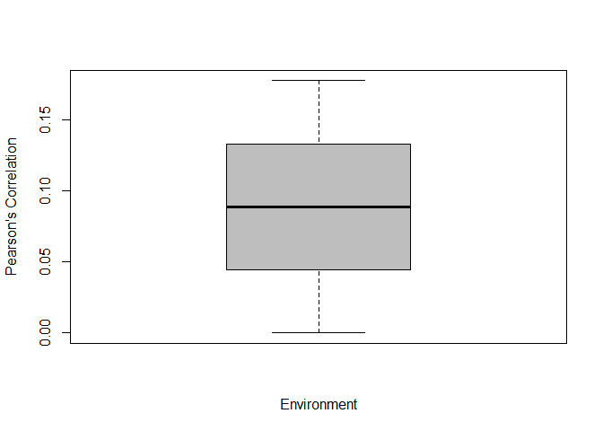
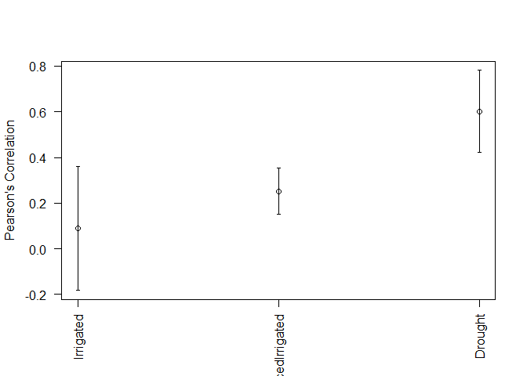

BFR
================
Last README update: 2018-02-26

*B*ayesian genomic *F*unctional *R*egression analysis in R

[](https://cran.r-project.org/package=BFR "CRAN Page") [](https://www.gnu.org/licenses/lgpl-3.0 "LGPL, Version 2.0") [](http://www.repostatus.org/#wip "status - Initial development is in progress, but there has not yet been a stable, usable release suitable for the public") [](https://cran.r-project.org/package=BFR "CRAN Page")

New in this dev version
-----------------------

-   This is a pre-release, be careful.

Instructions for proper implementation
--------------------------------------

### Installation

To complete installation of dev version of BFR from GitHub, you have to install a few packages first.

``` r
install.packages('devtools')
devtools::install_github('frahik/BFR')
```

### Quick use

#### Load data

``` r
rm(list = ls())
library(BFR)
data("wheat_BFR")

data <- Wheat # Load from data wheat_BFR
Bands <- Bands # Load from data wheat_BFR
Wavelengths <- Wavelengths # Load from data wheat_BFR
```

#### Fit model

``` r
data("wheat_BFR")
data <- Wheat[which(Wheat$Env == 'Drought'), ]

fm <- BFR(data, nIter = 1000, burnIn = 300)

# summary(fm)
plot(fm)
```


### Cross-validation model with kfold

``` r
data("wheat_BFR")
data <- Wheat[which(Wheat$Env == 'Drought'), ]
Crossvalidation_list <- list(Type = 'KFold', nFolds = 3)

pm <- BFR(data, nIter = 1000, burnIn = 300, set_seed = 10, CrossValidation = Crossvalidation_list)
```

    ## This might be time demanding, let's take sit and a cup of coffe
    ## 
    Fitting the 1 CV of 3  [========----------------------] Time elapsed:  0s
    Fitting the 2 CV of 3  [===============---------------] Time elapsed:  1s

    ## Warning in cor(Tab_i$y_p, Tab_i$y_o, use = "pairwise.complete.obs"): the
    ## standard deviation is zero

    ## 
    Fitting the 3 CV of 3  [======================--------] Time elapsed:  1s
    Fitting the 3 CV of 3  [==============================] Time elapsed:  2s
    ## Done.

``` r
summary(pm)
```

    ##                     Length Class      Mode   
    ## predictions_Summary   6    data.frame list   
    ## cv                    3    -none-     list   
    ## response            100    -none-     numeric
    ## predictions         100    -none-     numeric

``` r
boxplot(pm)
```



### Auto-detection of linear predictor

``` r
data("wheat_BFR")
Crossvalidation_list <- list(Type = 'KFold', nFolds = 3)
ETA2 <- ETAGenerate(Wheat, functionalType = 'Bspline.Basis', Bands = Bands, Wavelengths = Wavelengths, priorType = 'BayesB', bandsType = 'Alternative', n.basis = 21)


pm2 <- BFR(ETA = ETA2, data, nIter = 10000, burnIn = 3000, set_seed = 10, CrossValidation = Crossvalidation_list)
```

    ## This might be time demanding, let's take sit and a cup of coffe
    ## 
    Fitting the 1 CV of 3  [========----------------------] Time elapsed:  0s
    Fitting the 2 CV of 3  [===============---------------] Time elapsed:  6s
    Fitting the 3 CV of 3  [======================--------] Time elapsed: 11s
    Fitting the 3 CV of 3  [==============================] Time elapsed: 16s
    ## Done.

``` r
summary(pm2)
```

    ##                     Length Class      Mode   
    ## predictions_Summary   6    data.frame list   
    ## cv                    3    -none-     list   
    ## response            300    -none-     numeric
    ## predictions         300    -none-     numeric

``` r
plot(pm2)
```



### Handmade linear predictor

``` r
CrossV <- list(Type = 'KFold', nFolds = 5)
ETA3 <- list(Env = list(X = model.matrix(~0+as.factor(Wheat$Env)), model = 'FIXED'),
             Line = list(X = model.matrix(~0+as.factor(Wheat$Line)), model = 'BRR'),
             Bands = list(X = Bspline.Basis(Bands, Wavelengths, n.basis = 23), model = 'BayesA'))
pm3 <- BFR(data = Wheat, ETA = ETA3, nIter = 15000, burnIn = 10000, CrossValidation = CrossV, set_seed = 10)
summary(pm3)

plot(pm3, select = 'MSEP')
boxplot(pm3, select = 'MSEP')
```

### Params

In progress

Advanced demos
--------------

Citation
--------

How to cite the package... Coming soon.

Issues
------

Feel free to report new issues in this link [Issues](https://github.com/frahik/IBCF.MTME/issues/new)

Authors
-------

-   Francisco Javier Luna-Vázquez (Author, Maintainer)
-   Osval Antonio Montesinos-López (Author)
-   Abelardo Montesinos-López (Author)
-   José Crossa (Author)
