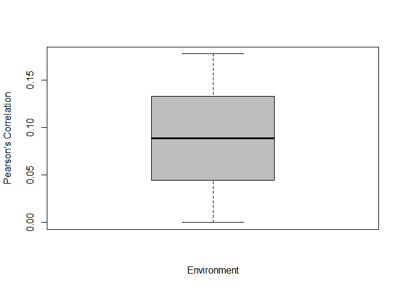
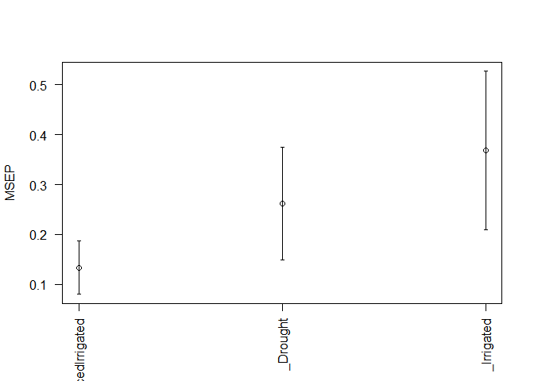
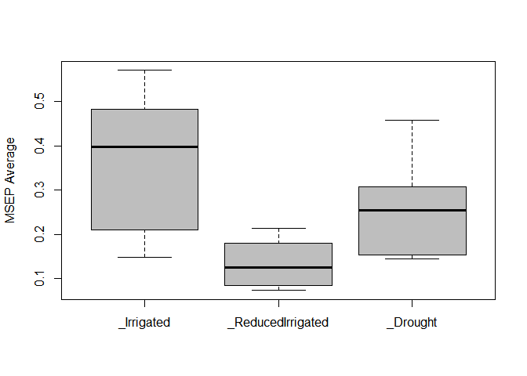

BFR
================
Last README update: 2018-02-28

**B**ayesian genomic **F**unctional **R**egression analysis in R -
Development version 0.9 - rev 3

[](https://cran.r-project.org/package=BFR "CRAN Page")
[](https://www.gnu.org/licenses/lgpl-3.0 "LGPL, Version 2.0")
[](http://www.repostatus.org/#wip "status - Initial development is in progress, but there has not yet been a stable, usable release suitable for the public")
[](https://cran.r-project.org/package=BFR "CRAN Page")

## New in this dev version

  - This is a pre-release, be careful.

## Instructions for proper implementation

### Installation

To complete installation of dev version of BFR from GitHub, you have to
install a few packages first.

``` r
install.packages('devtools')
devtools::install_github('frahik/BFR')
```

### Quick use

#### Load data

``` r
rm(list = ls())
library(BFR)
data("Wheat_BFR")

data <- Wheat_BFR # Load from data Wheat_BFR
Bands <- Wheat_Bands # Load from data Wheat_BFR
Wavelengths <- Wheat_Wavelengths # Load from data Wheat_BFR

data("Maize_BFR")
data <- Maize_BFR # Load from data Maize_BFR
Bands <- Maize_Bands # Load from data Maize_BFR
Wavelengths <- Maize_Wavelenghts # Load from data Maize_BFR
```

#### Fit model

``` r
data("Wheat_BFR")
data <- Wheat_BFR[which(Wheat_BFR$Env == 'Drought'), ]

fm <- BFR(data, nIter = 1000, burnIn = 300, verbose = F)

plot(fm)
```

<!-- -->

### Cross-validation model with kfold

``` r
data("Wheat_BFR")
data <- Wheat_BFR[which(Wheat_BFR$Env == 'Drought'), ]
Crossvalidation_list <- list(Type = 'KFold', nFolds = 3)

pm <- BFR(data, nIter = 1000, burnIn = 300, set_seed = 10, CrossValidation = Crossvalidation_list, verbose = F)
```

    ## Warning in cor(Tab_i$y_p, Tab_i$y_o, use = "pairwise.complete.obs"): the
    ## standard deviation is zero

``` r
summary(pm)
```

    ##          Fold     Env Trait Pearson SE_Pearson   MSEP SE_MSEP   Time
    ## 1           1 Drought        0.1775         NA 0.2653      NA 2.2200
    ## 2           2 Drought            NA         NA 0.6432      NA 0.1100
    ## 3           3 Drought       -0.0001         NA 0.4550      NA 0.1100
    ## 4 Average_all Drought        0.0887     0.0725 0.4545  0.1091 0.8133

``` r
boxplot(pm)
```

<!-- -->

### Auto-detection of linear predictor (Only Environment)

``` r
data("Wheat_BFR")
CrossV <- list(Type = 'KFold', nFolds = 3)
ETA2 <- ETAGenerate(Wheat_BFR, basisType = 'Bspline.Basis', 
                    Bands = Wheat_Bands, Wavelengths = Wheat_Wavelengths,
                    priorType = 'BayesB', method = 'Alternative', nBasis = 21)


pm2 <- BFR(ETA = ETA2, data, nIter = 1000, burnIn = 300, set_seed = 10, CrossValidation = CrossV, verbose = F)
summary(pm2)
```

    ##           Fold              Env Trait Pearson SE_Pearson   MSEP SE_MSEP
    ## 1            1        Irrigated       -0.0155         NA 0.1626      NA
    ## 2            1          Drought        0.3556         NA 0.3511      NA
    ## 3            1 ReducedIrrigated        0.3965         NA 0.0933      NA
    ## 4            2 ReducedIrrigated        0.4418         NA 0.1859      NA
    ## 5            2          Drought        0.7138         NA 0.2074      NA
    ## 6            2        Irrigated        0.2270         NA 0.3137      NA
    ## 7            3          Drought        0.6125         NA 0.3732      NA
    ## 8            3 ReducedIrrigated        0.1405         NA 0.1433      NA
    ## 9            3        Irrigated       -0.1899         NA 0.5908      NA
    ## 10 Average_all        Irrigated        0.0072     0.1209 0.3557  0.1254
    ## 11 Average_all          Drought        0.5606     0.1066 0.3105  0.0520
    ## 12 Average_all ReducedIrrigated        0.3263     0.0938 0.1408  0.0268
    ##    Time
    ## 1  1.33
    ## 2    NA
    ## 3    NA
    ## 4  1.08
    ## 5    NA
    ## 6    NA
    ## 7  1.22
    ## 8    NA
    ## 9    NA
    ## 10 1.21
    ## 11   NA
    ## 12   NA

``` r
plot(pm2)
```

<!-- -->

### Auto-detection of linear predictor (Multi-Trait & Multi-Environment)

``` r
data("Maize_BFR")
CrossV <- list(Type = 'RandomPartition', NPartitions = 5, PTesting = .25)
ETA3 <- ETAGenerate(Maize_BFR, basisType = 'Bspline.Basis', Bands = Maize_Bands, priorType = 'BRR', method = 'Simple', nBasis = 21)
ETA3$Design
```

    ## [1] "MultiBands"

``` r
ETA3$Basis
```

    ## [1] "Bspline.Basis"

``` r
ETA3$Prior
```

    ## [1] "BRR"

``` r
ETA3$Method
```

    ## [1] "Simple"

``` r
pm3 <- BFR(ETA = ETA3, data, nIter = 1000, burnIn = 300, set_seed = 10, CrossValidation = CrossV, verbose = F)
summary(pm3)
```

    ##           Fold Env Trait Pearson SE_Pearson     MSEP SE_MSEP   Time
    ## 1            1 EBU   ASI  0.1110         NA   3.4388      NA 32.440
    ## 2            1 KAK   ASI -0.0961         NA   6.2387      NA     NA
    ## 3            1 KTI   ASI  0.1799         NA   3.9410      NA     NA
    ## 4            1 EBU    PH -0.0273         NA 119.1014      NA     NA
    ## 5            1 KAK    PH  0.4455         NA 164.6014      NA     NA
    ## 6            1 KTI    PH -0.0057         NA 334.2636      NA     NA
    ## 7            1 EBU Yield -0.0868         NA   4.1275      NA     NA
    ## 8            1 KAK Yield  0.0740         NA   5.5444      NA     NA
    ## 9            1 KTI Yield -0.1746         NA   5.7512      NA     NA
    ## 10           2 EBU   ASI  0.1197         NA   4.4065      NA 33.190
    ## 11           2 KAK   ASI  0.0573         NA   4.3010      NA     NA
    ## 12           2 KTI   ASI -0.1506         NA   4.9604      NA     NA
    ## 13           2 EBU    PH -0.0836         NA 115.2953      NA     NA
    ## 14           2 KAK    PH  0.3305         NA 126.0612      NA     NA
    ## 15           2 KTI    PH  0.4105         NA 223.1208      NA     NA
    ## 16           2 EBU Yield  0.1080         NA   5.1238      NA     NA
    ## 17           2 KAK Yield  0.0290         NA   4.1199      NA     NA
    ## 18           2 KTI Yield  0.1934         NA   4.4422      NA     NA
    ## 19           3 EBU   ASI  0.0402         NA   5.5519      NA 33.510
    ## 20           3 KAK   ASI  0.0556         NA   5.8688      NA     NA
    ## 21           3 KTI   ASI  0.1785         NA   5.2720      NA     NA
    ## 22           3 EBU    PH  0.0714         NA 448.5080      NA     NA
    ## 23           3 KAK    PH  0.3937         NA 116.4316      NA     NA
    ## 24           3 KTI    PH  0.1872         NA 306.2555      NA     NA
    ## 25           3 EBU Yield -0.1065         NA   6.5118      NA     NA
    ## 26           3 KAK Yield -0.0955         NA   5.1368      NA     NA
    ## 27           3 KTI Yield  0.0853         NA   6.0447      NA     NA
    ## 28           4 EBU   ASI  0.1468         NA   4.8340      NA 33.890
    ## 29           4 KAK   ASI -0.0307         NA   6.4775      NA     NA
    ## 30           4 KTI   ASI  0.0407         NA   4.8319      NA     NA
    ## 31           4 EBU    PH  0.1236         NA  99.8174      NA     NA
    ## 32           4 KAK    PH  0.4150         NA 133.2677      NA     NA
    ## 33           4 KTI    PH  0.4061         NA 170.5294      NA     NA
    ## 34           4 EBU Yield  0.1343         NA   5.6122      NA     NA
    ## 35           4 KAK Yield  0.0695         NA   6.0613      NA     NA
    ## 36           4 KTI Yield  0.0443         NA   5.1520      NA     NA
    ## 37           5 EBU   ASI  0.1177         NA   3.5642      NA 30.410
    ## 38           5 KAK   ASI -0.0261         NA   3.8439      NA     NA
    ## 39           5 KTI   ASI -0.0813         NA   3.3151      NA     NA
    ## 40           5 EBU    PH  0.0473         NA 440.4937      NA     NA
    ## 41           5 KAK    PH  0.3156         NA 111.7260      NA     NA
    ## 42           5 KTI    PH  0.1162         NA 269.9482      NA     NA
    ## 43           5 EBU Yield  0.2068         NA   3.8649      NA     NA
    ## 44           5 KAK Yield  0.0520         NA   3.9284      NA     NA
    ## 45           5 KTI Yield -0.2161         NA   3.7772      NA     NA
    ## 46 Average_all EBU   ASI  0.1071     0.0178   4.3591  0.3956 32.688
    ## 47 Average_all KAK   ASI -0.0080     0.0291   5.3460  0.5338     NA
    ## 48 Average_all KTI   ASI  0.0334     0.0669   4.4641  0.3625     NA
    ## 49 Average_all EBU    PH  0.0263     0.0367 244.6432 81.6653     NA
    ## 50 Average_all KAK    PH  0.3800     0.0248 130.4176  9.3290     NA
    ## 51 Average_all KTI    PH  0.2229     0.0818 260.8235 29.2535     NA
    ## 52 Average_all EBU Yield  0.0512     0.0625   5.0481  0.4855     NA
    ## 53 Average_all KAK Yield  0.0258     0.0313   4.9582  0.4096     NA
    ## 54 Average_all KTI Yield -0.0135     0.0784   5.0335  0.4171     NA

### Handmade linear predictor

``` r
CrossV <- list(Type = 'KFold', nFolds = 5)
ETA4 <- list(Env = list(X = model.matrix(~0+as.factor(Wheat_BFR$Env)), model = 'FIXED'),
             Line = list(X = model.matrix(~0+as.factor(Wheat_BFR$Line)), model = 'BRR'),
             Bands = list(X = Bspline.Basis(Wheat_Bands, Wheat_Wavelengths, nBasis = 23), model = 'BayesA'))
pm4 <- BFR(data = Wheat_BFR, ETA = ETA4, nIter = 1000, burnIn = 300, CrossValidation = CrossV, set_seed = 10, verbose = F)
summary(pm4)
```

    ##           Fold              Env Trait Pearson SE_Pearson   MSEP SE_MSEP
    ## 1            1        Irrigated        0.3035         NA 0.1476      NA
    ## 2            1          Drought        0.2644         NA 0.4583      NA
    ## 3            1 ReducedIrrigated        0.5706         NA 0.0730      NA
    ## 4            2 ReducedIrrigated        0.4185         NA 0.1796      NA
    ## 5            2          Drought        0.6301         NA 0.1445      NA
    ## 6            2        Irrigated        0.1378         NA 0.4288      NA
    ## 7            3 ReducedIrrigated        0.1951         NA 0.2130      NA
    ## 8            3          Drought        0.6930         NA 0.3071      NA
    ## 9            3        Irrigated        0.4047         NA 0.2105      NA
    ## 10           4 ReducedIrrigated        0.6902         NA 0.0841      NA
    ## 11           4        Irrigated       -0.3249         NA 0.4834      NA
    ## 12           4          Drought        0.8480         NA 0.1537      NA
    ## 13           5        Irrigated       -0.2126         NA 0.5707      NA
    ## 14           5 ReducedIrrigated        0.3979         NA 0.1157      NA
    ## 15           5          Drought        0.7617         NA 0.2453      NA
    ## 16 Average_all        Irrigated        0.0617     0.1426 0.3682  0.0811
    ## 17 Average_all          Drought        0.6394     0.1005 0.2618  0.0576
    ## 18 Average_all ReducedIrrigated        0.4545     0.0839 0.1331  0.0273
    ##     Time
    ## 1  0.620
    ## 2     NA
    ## 3     NA
    ## 4  1.020
    ## 5     NA
    ## 6     NA
    ## 7  0.830
    ## 8     NA
    ## 9     NA
    ## 10 0.840
    ## 11    NA
    ## 12    NA
    ## 13 0.780
    ## 14    NA
    ## 15    NA
    ## 16 0.818
    ## 17    NA
    ## 18    NA

``` r
plot(pm4, select = 'MSEP')
```

<!-- -->

``` r
boxplot(pm4, select = 'MSEP')
```

<!-- -->

## Citation

How to cite the package… Coming soon.

## Issues

Feel free to report new issues in this link
[Issues](https://github.com/frahik/IBCF.MTME/issues/new)

## Authors

  - Francisco Javier Luna-Vázquez (Author, Maintainer)
  - Osval Antonio Montesinos-López (Author)
  - Abelardo Montesinos-López (Author)
  - José Crossa (Author)
