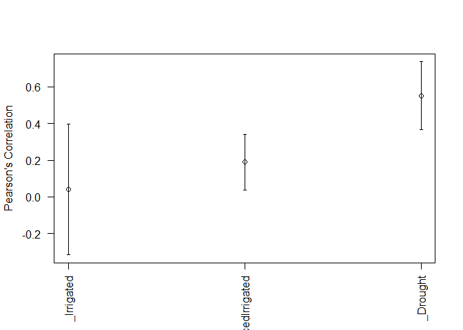

<p align="center">
<a href="https://github.com/frahik/GFR">  </a>
<h3 align="center">
    Genomic Functional Regression analysis in R | Development version 0.9 - rev 7 

</h4>
<p align="center">
<a href="https://www.gnu.org/licenses/lgpl-3.0">  </a> <a href="http://www.repostatus.org/#wip">  </a> <a href="">  </a> <a href="https://cran.r-project.org/package=GFR">  </a>
</p>
<h4 align="center">
    [Last README update: 2018-03-22]

</h4>
</p>

------------------------------------------------------------------------

Table of contents
=================

-   [NEWS](#news)
-   [instructions](#instructions)
    -   [Installation](#install)
    -   [Demostration examples](#demo)
    -   [Web version](#shinyapp)
    -   [Available data](#data)
    -   [Fitting a model](#fit-model)
    -   [Predictive model](#predictive-model)
    -   [Example \#1 of how generate automatically a linear predictor](#auto-ETA)
    -   [Example \#2 of how generate automatically a linear predictor](#auto-ETA2)
    -   [Example of how generate manually a linear predictor](#HM-ETA)
-   [How to cite this package](#cite)
-   [Contributions](#contributions)
-   [Authors](#authors)

<h2 id="news">
News of this version (0.9)
</h2>
     * The package now inclues a shiny app.
     * Rename from BGFRA -> BFR -> GFR
     * Initial development is in progress, but there has not yet been a stable, usable release suitable for the public; this is a pre-release, be careful.

<h2 id="instructions">
Instructions for proper implementation
</h2>
<h3 id="install">
Installation
</h3>
To complete installation of dev version of GFR from GitHub, you have to install a few packages first.

``` r
install.packages('devtools')
devtools::install_github('frahik/GFR')
```

<h3 id="demo">
Demostration examples
</h3>
<h4 id="shinyapp">
Package Web version
</h4>
The package includes a shiny app to very easy use of the package, includes the most essencial parts, to use this,

``` r
library(GFR)
runInterface()
```

<h4 id="data">
Availabe data
</h4>
Three data sets are available inside the package, to use it use `data()` function,

``` r
rm(list = ls())
library(GFR)
data("Wheat_GFR")
head(Wheat_GFR) # Load from data Wheat_GFR
```

    ##   Response    Line     Env
    ## 1 1.587324 3827768 Drought
    ## 2 3.140629 6176013 Drought
    ## 3 3.145934 4905617 Drought
    ## 4 0.984776 6931494 Drought
    ## 5 2.936291 6932344 Drought
    ## 6 1.882823 6935856 Drought

``` r
paste0('Dimension of the Bands matrix: ', dim(Wheat_Bands)) # Load from data Wheat_GFR
```

    ## [1] "Dimension of the Bands matrix: 300"
    ## [2] "Dimension of the Bands matrix: 250"

``` r
paste0('Number of wavelenths:', length(Wheat_Wavelengths)) # Load from data Wheat_GFR
```

    ## [1] "Number of wavelenths:250"

``` r
data("WheatI_GFR")
head(WheatI_GFR) # Load from data WheatI_GFR
```

    ##   Line Response       Env
    ## 1    1 6.862352 Irrigated
    ## 2    2 6.844494 Irrigated
    ## 3    3 6.290179 Irrigated
    ## 4    4 7.026786 Irrigated
    ## 5    5 6.013394 Irrigated
    ## 6    6 6.639137 Irrigated

``` r
paste0('Dimension of the Bands matrix: ',dim(WheatI_Bands)) # Load from data WheatI_GFR
```

    ## [1] "Dimension of the Bands matrix: 976"
    ## [2] "Dimension of the Bands matrix: 250"

``` r
paste0('Number of wavelenths:',length(WheatI_Wavelengths)) # Load from data WheatI_GFR
```

    ## [1] "Number of wavelenths:250"

``` r
data("Maize_GFR")
head(Maize_GFR) # Load from data Maize_GFR
```

    ##        Line Env Trait Response
    ## 1 CKDHL0002 EBU Yield     6.65
    ## 2 CKDHL0003 EBU Yield     6.10
    ## 3 CKDHL0004 EBU Yield     5.07
    ## 4 CKDHL0005 EBU Yield     6.55
    ## 5 CKDHL0007 EBU Yield     6.82
    ## 6 CKDHL0008 EBU Yield     6.88

``` r
paste0('Dimension of the Bands matrix: ',dim(Maize_Bands)) # Load from data Maize_GFR
```

    ## [1] "Dimension of the Bands matrix: 2781"
    ## [2] "Dimension of the Bands matrix: 48"

``` r
paste0('Number of wavelenths:',length( Maize_Wavelengths)) # Load from data Maize_GFR
```

    ## [1] "Number of wavelenths:48"

<h4 id="fit-model">
Fitting a model
</h4>
``` r
data("Wheat_GFR")
data <- Wheat_GFR[which(Wheat_GFR$Env == 'Drought'), ]

fm <- BFR(data, nIter = 1000, burnIn = 300, verbose = F)

plot(fm)
```


<h4 id="predictive-model">
Predictive model with a K-Folds Cross-validation
</h4>
``` r
data("Wheat_GFR")
data <- Wheat_GFR[which(Wheat_GFR$Env == 'Drought'), ]
Crossvalidation_list <- list(Type = 'KFold', nFolds = 3)

pm <- BFR(data, nIter = 1000, burnIn = 300, set_seed = 10, CrossValidation = Crossvalidation_list, verbose = F)
```

    ## Warning in cor(Tab_i$y_p, Tab_i$y_o, use = "pairwise.complete.obs"): the
    ## standard deviation is zero

``` r
summary(pm)
```

    ##          Fold     Env Trait Pearson SE_Pearson   MSEP SE_MSEP   Time
    ## 1           1 Drought        0.1775         NA 0.2653      NA 1.1860
    ## 2           2 Drought            NA         NA 0.6432      NA 0.0720
    ## 3           3 Drought       -0.0001         NA 0.4550      NA 0.0630
    ## 4 Average_all Drought        0.0887     0.0725 0.4545  0.1091 0.4403

``` r
boxplot(pm)
```


<h4 id="auto-ETA">
Generate automatically a linear predictor (Only Multi-Environment example)
</h4>
``` r
library(GFR)
data("Wheat_GFR")
CrossV <- list(Type = 'KFold', nFolds = 3)
ETA2 <- ETAGenerate(Wheat_GFR, datasetID = 'Line', priorType = 'BayesB', Bands = Wheat_Bands,
                    Wavelengths = Wheat_Wavelengths, method = 'Alternative2', basisType = 'Bspline.Basis', nBasis = 21)


pm2 <- BFR(ETA = ETA2, data, nIter = 1000, burnIn = 300, set_seed = 10, CrossValidation = CrossV, verbose = F)
summary(pm2)
```

    ##           Fold              Env Trait Pearson SE_Pearson   MSEP SE_MSEP
    ## 1            1        Irrigated        0.2519         NA 0.1672      NA
    ## 2            1          Drought        0.3727         NA 0.3692      NA
    ## 3            1 ReducedIrrigated        0.0914         NA 0.1330      NA
    ## 4            2 ReducedIrrigated        0.3414         NA 0.1868      NA
    ## 5            2          Drought        0.6947         NA 0.2161      NA
    ## 6            2        Irrigated        0.1901         NA 0.3198      NA
    ## 7            3          Drought        0.5841         NA 0.3702      NA
    ## 8            3 ReducedIrrigated        0.1342         NA 0.1391      NA
    ## 9            3        Irrigated       -0.3217         NA 0.5997      NA
    ## 10 Average_all        Irrigated        0.0401     0.1818 0.3622  0.1266
    ## 11 Average_all          Drought        0.5505     0.0945 0.3185  0.0512
    ## 12 Average_all ReducedIrrigated        0.1890     0.0772 0.1529  0.0170
    ##      Time
    ## 1  0.8960
    ## 2      NA
    ## 3      NA
    ## 4  0.9730
    ## 5      NA
    ## 6      NA
    ## 7  0.8650
    ## 8      NA
    ## 9      NA
    ## 10 0.9113
    ## 11     NA
    ## 12     NA

``` r
plot(pm2)
```



<h4 id="auto-ETA2">
Generate automatically a linear predictor (Multi-Trait & Multi-Environment example)
</h4>
``` r
data("Maize_GFR")
CrossV <- list(Type = 'RandomPartition', NPartitions = 5, PTesting = .25)
ETA3 <- ETAGenerate(Maize_GFR, basisType = 'Bspline.Basis', Bands = Maize_Bands, Wavelengths = Maize_Wavelengths, priorType = 'BRR', method = 'Simple', nBasis = 21)
ETA3$Design
```

    ## [1] "Bayes-MultiBands"

``` r
ETA3$Basis
```

    ## [1] "Bspline.Basis"

``` r
ETA3$Prior
```

    ## [1] "BRR"

``` r
ETA3$Method
```

    ## [1] "Simple"

``` r
pm3 <- BFR(ETA = ETA3, data, nIter = 1000, burnIn = 300, set_seed = 10, CrossValidation = CrossV, verbose = F)
summary(pm3)
```

    ##           Fold Env Trait Pearson SE_Pearson     MSEP SE_MSEP    Time
    ## 1            1 EBU   ASI  0.0818         NA   5.5920      NA 33.6520
    ## 2            1 KAK   ASI  0.0897         NA   5.4972      NA      NA
    ## 3            1 KTI   ASI  0.1983         NA   5.9503      NA      NA
    ## 4            1 EBU    PH -0.0014         NA 123.3057      NA      NA
    ## 5            1 KAK    PH  0.4269         NA 166.8797      NA      NA
    ## 6            1 KTI    PH  0.0419         NA 326.3063      NA      NA
    ## 7            1 EBU Yield -0.0793         NA   6.8618      NA      NA
    ## 8            1 KAK Yield -0.0218         NA   5.6789      NA      NA
    ## 9            1 KTI Yield -0.0608         NA   7.5300      NA      NA
    ## 10           2 EBU   ASI  0.0245         NA   4.6165      NA 32.3570
    ## 11           2 KAK   ASI -0.0066         NA   6.1229      NA      NA
    ## 12           2 KTI   ASI -0.0722         NA   4.5063      NA      NA
    ## 13           2 EBU    PH  0.0469         NA 102.8028      NA      NA
    ## 14           2 KAK    PH  0.4357         NA 114.6915      NA      NA
    ## 15           2 KTI    PH  0.4313         NA 221.3545      NA      NA
    ## 16           2 EBU Yield  0.1116         NA   4.3112      NA      NA
    ## 17           2 KAK Yield  0.3214         NA   4.8599      NA      NA
    ## 18           2 KTI Yield  0.1596         NA   4.3757      NA      NA
    ## 19           3 EBU   ASI -0.1242         NA   5.0020      NA 32.6330
    ## 20           3 KAK   ASI  0.0759         NA   5.5440      NA      NA
    ## 21           3 KTI   ASI  0.1949         NA   4.8371      NA      NA
    ## 22           3 EBU    PH  0.0229         NA 458.4495      NA      NA
    ## 23           3 KAK    PH  0.3700         NA 118.9567      NA      NA
    ## 24           3 KTI    PH  0.1867         NA 308.4166      NA      NA
    ## 25           3 EBU Yield -0.0659         NA   6.0567      NA      NA
    ## 26           3 KAK Yield -0.0231         NA   5.1622      NA      NA
    ## 27           3 KTI Yield  0.0842         NA   5.5449      NA      NA
    ## 28           4 EBU   ASI -0.0486         NA   6.8234      NA 33.1740
    ## 29           4 KAK   ASI  0.0863         NA   6.7819      NA      NA
    ## 30           4 KTI   ASI  0.1523         NA   4.3941      NA      NA
    ## 31           4 EBU    PH  0.1030         NA 103.2326      NA      NA
    ## 32           4 KAK    PH  0.3981         NA 135.7808      NA      NA
    ## 33           4 KTI    PH  0.5067         NA 159.8392      NA      NA
    ## 34           4 EBU Yield  0.0057         NA   6.6224      NA      NA
    ## 35           4 KAK Yield  0.0940         NA   6.6943      NA      NA
    ## 36           4 KTI Yield  0.1374         NA   5.0233      NA      NA
    ## 37           5 EBU   ASI  0.2135         NA   5.0522      NA 33.9270
    ## 38           5 KAK   ASI -0.0246         NA   7.6460      NA      NA
    ## 39           5 KTI   ASI -0.1267         NA   5.3158      NA      NA
    ## 40           5 EBU    PH  0.0844         NA 431.1487      NA      NA
    ## 41           5 KAK    PH  0.2942         NA 114.0388      NA      NA
    ## 42           5 KTI    PH  0.0787         NA 276.4580      NA      NA
    ## 43           5 EBU Yield  0.2978         NA   4.6376      NA      NA
    ## 44           5 KAK Yield  0.0654         NA   7.0154      NA      NA
    ## 45           5 KTI Yield -0.0740         NA   5.5507      NA      NA
    ## 46 Average_all EBU   ASI  0.0294     0.0576   5.4172  0.3844 33.1486
    ## 47 Average_all KAK   ASI  0.0441     0.0247   6.3184  0.4056      NA
    ## 48 Average_all KTI   ASI  0.0693     0.0699   5.0007  0.2864      NA
    ## 49 Average_all EBU    PH  0.0512     0.0192 243.7879 82.2594      NA
    ## 50 Average_all KAK    PH  0.3850     0.0255 130.0695 10.0114      NA
    ## 51 Average_all KTI    PH  0.2491     0.0937 258.4749 30.4348      NA
    ## 52 Average_all EBU Yield  0.0540     0.0697   5.6979  0.5189      NA
    ## 53 Average_all KAK Yield  0.0872     0.0630   5.8821  0.4212      NA
    ## 54 Average_all KTI Yield  0.0493     0.0492   5.6049  0.5273      NA

<h4 id="HM-ETA">
Handmade linear predictor
</h4>
``` r
CrossV <- list(Type = 'KFold', nFolds = 5)
ETA4 <- list(Env = list(X = model.matrix(~0+as.factor(Wheat_GFR$Env)), model = 'FIXED'),
             Line = list(X = model.matrix(~0+as.factor(Wheat_GFR$Line)), model = 'BRR'),
             Bands = list(X = Bspline.Basis(Wheat_Bands, Wheat_Wavelengths, nBasis = 23), model = 'BayesA'))
pm4 <- BFR(data = Wheat_GFR, ETA = ETA4, nIter = 1000, burnIn = 300, CrossValidation = CrossV, set_seed = 10, verbose = F)
summary(pm4)
```

    ##           Fold              Env Trait Pearson SE_Pearson   MSEP SE_MSEP
    ## 1            1        Irrigated        0.3035         NA 0.1476      NA
    ## 2            1          Drought        0.2644         NA 0.4583      NA
    ## 3            1 ReducedIrrigated        0.5706         NA 0.0730      NA
    ## 4            2 ReducedIrrigated        0.4185         NA 0.1796      NA
    ## 5            2          Drought        0.6301         NA 0.1445      NA
    ## 6            2        Irrigated        0.1378         NA 0.4288      NA
    ## 7            3 ReducedIrrigated        0.1951         NA 0.2130      NA
    ## 8            3          Drought        0.6930         NA 0.3071      NA
    ## 9            3        Irrigated        0.4047         NA 0.2105      NA
    ## 10           4 ReducedIrrigated        0.6902         NA 0.0841      NA
    ## 11           4        Irrigated       -0.3249         NA 0.4834      NA
    ## 12           4          Drought        0.8480         NA 0.1537      NA
    ## 13           5        Irrigated       -0.2126         NA 0.5707      NA
    ## 14           5 ReducedIrrigated        0.3979         NA 0.1157      NA
    ## 15           5          Drought        0.7617         NA 0.2453      NA
    ## 16 Average_all        Irrigated        0.0617     0.1426 0.3682  0.0811
    ## 17 Average_all          Drought        0.6394     0.1005 0.2618  0.0576
    ## 18 Average_all ReducedIrrigated        0.4545     0.0839 0.1331  0.0273
    ##      Time
    ## 1  0.3070
    ## 2      NA
    ## 3      NA
    ## 4  0.4590
    ## 5      NA
    ## 6      NA
    ## 7  0.3530
    ## 8      NA
    ## 9      NA
    ## 10 0.3660
    ## 11     NA
    ## 12     NA
    ## 13 0.3760
    ## 14     NA
    ## 15     NA
    ## 16 0.3722
    ## 17     NA
    ## 18     NA

``` r
plot(pm4, select = 'MSEP')
```


``` r
boxplot(pm4, select = 'MSEP')
```


<h2 id="cite">
How to cite this package
</h2>
First option, by the article paper

(Comming soon)

Second option, by the manual package

(Comming soon)

<h2 id="contributions">
Contributions
</h2>
If you have any suggestions or feedback, I would love to hear about it. Feel free to report new issues in [this link](https://github.com/frahik/GFR/issues/new), also if you want to request a feature/report a bug, or make a pull request if you can contribute.

<h2 id="authors">
Authors
</h2>
    * Francisco Javier Luna-Vázquez (Author, Maintainer)
    * Osval Antonio Montesinos-López (Author)
    * Abelardo Montesinos-López (Author)
    * José Crossa (Author)
    * Gustavo de los campos (Author)
